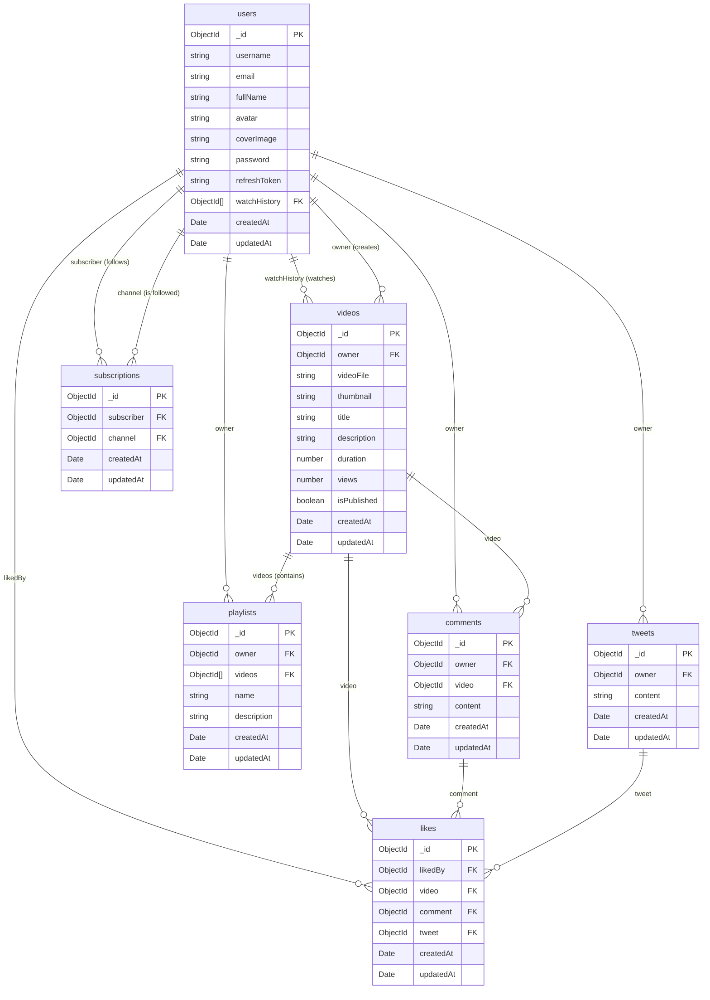

# RuTube Backend

This project is a robust backend application built with **Node.js**, **Express.js**, and **MongoDB**. It follows a modern, modular architecture with a strong emphasis on **security** and **scalability**.

## 🚀 Features

- **User Authentication**: Secure registration and login with JWT (JSON Web Tokens).
- **Media Management**: Upload and manage user avatars and cover images using **Cloudinary**.
- **Secure File Handling**: Integrated **Multer** middleware for handling file uploads.
- **Password Security**: bcrypt hashing for storing user passwords.
- **Access Control**: Protected routes using **JWT verification**.
- **Error Handling**: Centralized error handling with custom `ApiError` and `ApiResponse` classes.

## 🛠️ Tech Stack

- **Runtime**: [Node.js](https://nodejs.org/)
- **Framework**: [Express.js](https://expressjs.com/)
- **Database**: [MongoDB](https://www.mongodb.com/)
- **ORM/ODM**: [Mongoose](https://mongoosejs.com/)
- **Authentication**: `jsonwebtoken`
- **Security**: `bcryptjs`, `cookie-parser`
- **File Upload**: `multer`, `cloudinary`

## 📂 Project Structure

```
src/
├── config/       # Configuration files (e.g., database, cloudinary)
├── controllers/  # Business logic for API routes
├── middlewares/  # Express middleware (e.g., auth, upload)
├── models/       # Mongoose schemas for database models
├── routes/       # API route definitions
├── utils/        # Utility functions (e.g., API responses, error handlers)
└── app.js        # Express application entry point
```
## 📊 Database Schema (ER Diagram)

Our database is designed around a scalable, relational-style NoSQL architecture. Below is the Mermaid ER diagram representing all collections and their relationships. GitHub natively renders this as a visual diagram!


## 🚀 Getting Started

### Prerequisites

- [Node.js](https://nodejs.org/) (v18 or higher recommended)
- [npm](https://www.npmjs.com/)
- [MongoDB](https://www.mongodb.com/) (local or MongoDB Atlas)

### Installation

1. Clone the repository:
   ```bash
   git clone <repository-url>
   cd RuTube-Backend
   ```

2. Install dependencies:
   ```bash
   npm install
   ```

3. Set up environment variables:
   Create a `.env` file in the root directory based on `.env.example`:
   ```env
   PORT=5000
   MONGODB_URI=your_mongodb_connection_string
   ACCESS_TOKEN_SECRET=your_access_token_secret
   REFRESH_TOKEN_SECRET=your_refresh_token_secret
   ACCESS_TOKEN_EXPIRY=15m
   REFRESH_TOKEN_EXPIRY=1d
   
   CLOUDINARY_CLOUD_NAME=your_cloud_name
   CLOUDINARY_API_KEY=your_api_key
   CLOUDINARY_API_SECRET=your_api_secret
   ```

### Running the Server

```bash
npm run dev
```

The server will start on `http://localhost:<PORT>` (default: `http://localhost:5000`).

### Production Build

```bash
npm run build
npm start
```

## 📚 API Documentation

### Authentication

- **POST /api/v1/users/register**
  - Registers a new user.
  - Request Body:
    ```json
    {
      "username": "username",
      "email": "[EMAIL_ADDRESS]",
      "password": "password",
      "fullName": "Full Name"
    }
    ```
  - Requires files: `avatar` (1 file)

- **POST /api/v1/users/login**
  - Logs in a user.
  - Request Body:
    ```json
    {
      "email": "[EMAIL_ADDRESS]",
      "password": "password"
    }
    ```

- **POST /api/v1/users/logout**
  - Logs out a user.
  - Requires authentication.

- **POST /api/v1/users/refresh-token**
  - Refreshes an access token.
  - Requires authentication.

### User Management

- **GET /api/v1/users/current-user**
  - Gets the currently logged-in user.
  - Requires authentication.

- **PATCH /api/v1/users/update-account**
  - Updates user account details.
  - Requires authentication.

- **PATCH /api/v1/users/update-avatar**
  - Updates user avatar.
  - Requires authentication and file upload.

- **PATCH /api/v1/users/update-cover-image**
  - Updates user cover image.
  - Requires authentication and file upload.

### Channel & History

- **GET /api/v1/users/channel/:username**
  - Gets a user's channel profile.
  - Requires authentication.

- **GET /api/v1/users/watch-history**
  - Gets user's watch history.
  - Requires authentication.                        